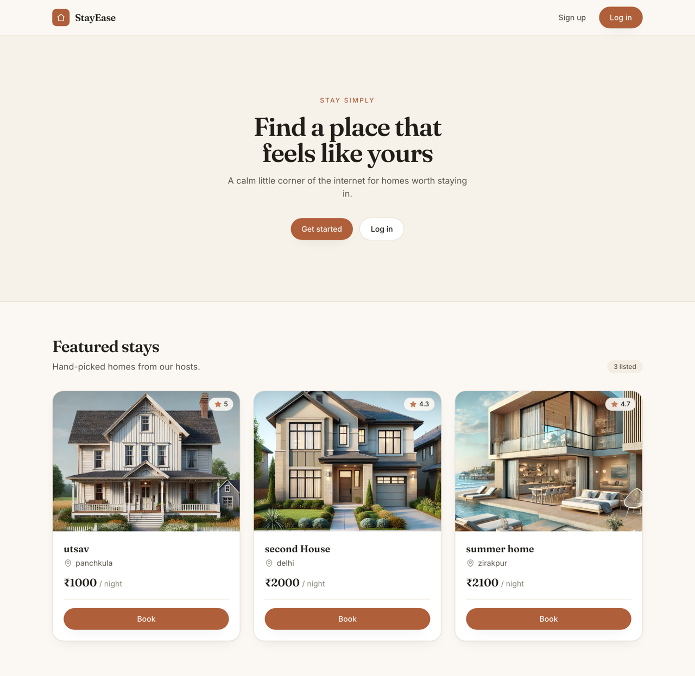
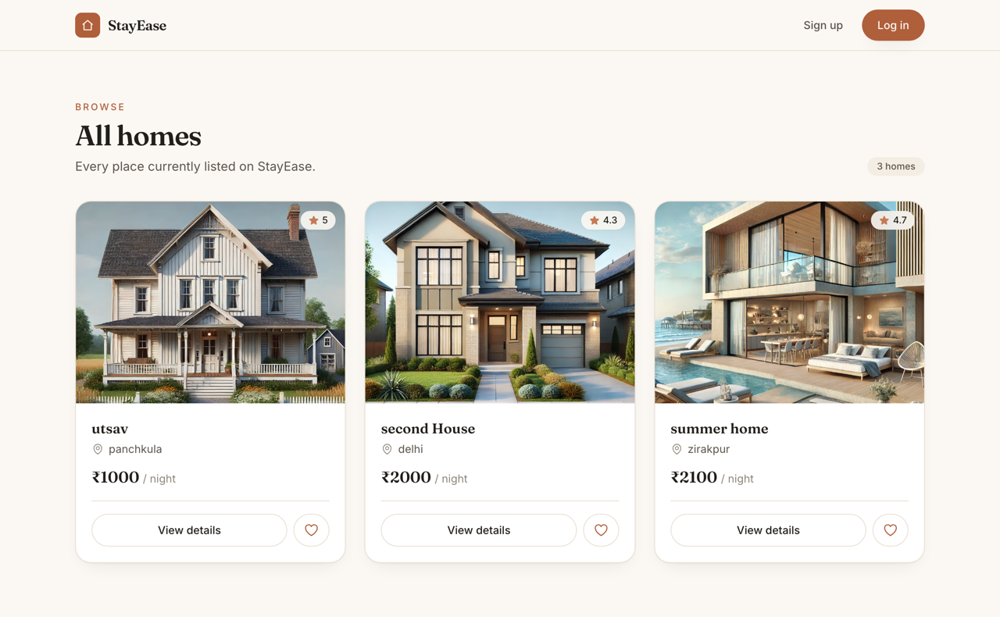
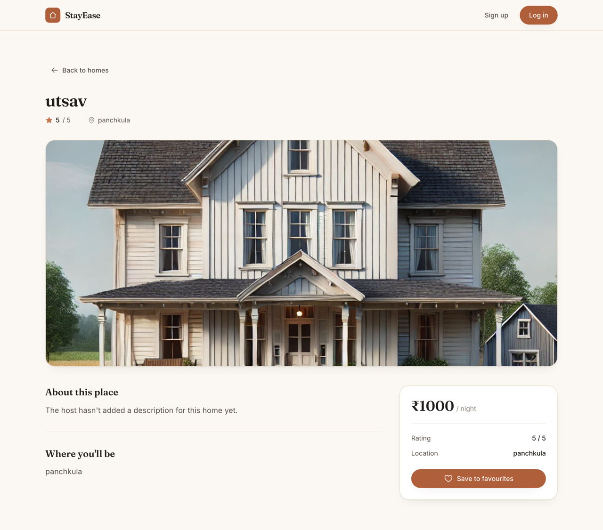
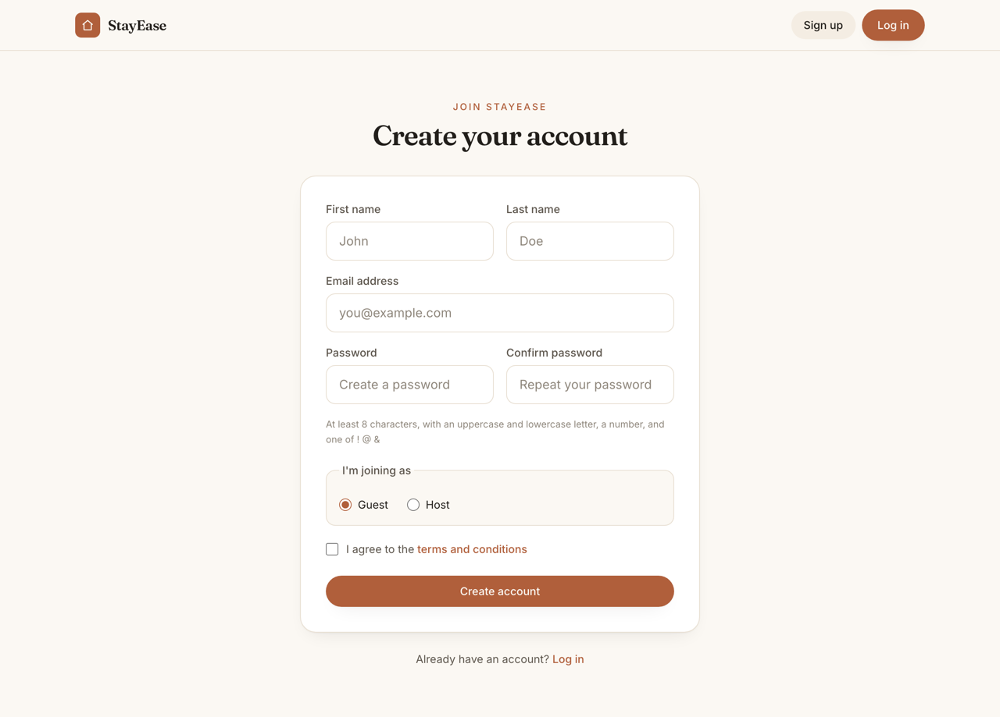

# StayEase

A home-rental web app built with Node, Express, EJS and MongoDB. Guests browse listings and save favourites; hosts publish and manage their own homes. Server-rendered throughout — no frontend framework.



## Screenshots

| Browse listings | Home detail |
| --- | --- |
|  |  |

<details>
<summary>Sign-up</summary>



</details>

## Features

**Accounts**
- Sign up as either a **guest** or a **host** — the role decides what the nav exposes
- Passwords hashed with bcrypt; sessions persisted in MongoDB so they survive a restart
- Server-side validation with clear, field-level error messages

**Guests**
- Browse every listing, or open one for the full detail view
- Save and remove favourites, kept per user

**Hosts**
- Publish a home with a photo upload, price, location, rating and description
- Edit or delete your listings; replacing a photo deletes the old file from disk
- `/host/*` routes are behind an auth guard

## Tech stack

| Layer | Choice |
| --- | --- |
| Runtime | Node.js, Express 4 |
| Views | EJS, Tailwind CSS 3 |
| Database | MongoDB via Mongoose |
| Sessions | express-session + connect-mongodb-session |
| Auth | bcryptjs, express-validator |
| Uploads | multer (disk storage, JPG/PNG only) |
| Tests | Jest, supertest, mongodb-memory-server |

## Getting started

**Prerequisites:** Node.js 18+ and a MongoDB connection string (local or Atlas).

```bash
git clone https://github.com/akashk604786-create/stayease.git && cd stayease && npm install
```

Create a `.env` file in the project root:

```
MONGO_URI=mongodb://127.0.0.1:27017/stayease
SESSION_SECRET=any-long-random-string
PORT=3006
```

Then build the stylesheet and start the server:

```bash
npm run build && npm run dev
```

Open **http://localhost:3006**.

> While working on the views, run `npm run tailwind` in a second terminal — it rebuilds the CSS on save.

## Scripts

| Command | What it does |
| --- | --- |
| `npm run dev` | Start with nodemon, restarting on `.js`, `.json` and `.ejs` changes |
| `npm start` | Start the server once |
| `npm run build` | Compile Tailwind into `public/output.css` |
| `npm run tailwind` | Same, in watch mode |
| `npm test` | Run the Jest suite against an in-memory MongoDB |

## Routes

| Method | Path | Purpose |
| --- | --- | --- |
| `GET` | `/` | Landing page with featured stays |
| `GET` | `/homes` | All listings |
| `GET` | `/homes/:homeId` | Single listing |
| `GET` | `/favourites` | Saved homes |
| `POST` | `/favourites` | Save a home |
| `POST` | `/favourites/delete/:homeId` | Unsave a home |
| `GET` | `/bookings` | Bookings page *(placeholder)* |
| `GET` `POST` | `/signup` · `/login` | Auth |
| `POST` | `/logout` | End the session |
| `GET` `POST` | `/host/add-home` | Publish a listing |
| `GET` | `/host/host-home-list` | Your listings |
| `GET` | `/host/edit-home/:homeId` | Edit form |
| `POST` | `/host/edit-home` | Save an edit |
| `POST` | `/host/delete-home/:homeId` | Delete a listing |

Everything under `/host` requires an active session.

## Project structure

```
app.js               Express app factory — middleware, sessions, routing
server.js            Connects to MongoDB, then starts the app
controllers/         Request handlers (auth, store, host, errors)
routes/              Route definitions
models/              Mongoose schemas (User, Home)
views/               EJS templates
  partials/          head, nav, home-card, errors, favourite
  input.css          Tailwind source — design tokens and component classes
public/output.css    Compiled stylesheet (committed, so a fresh clone renders)
uploads/             Uploaded listing photos
tests/               Jest + supertest suite
```

## Design

The interface uses a warm, minimal palette defined as Tailwind tokens in `tailwind.config.js`:

| Token | Value | Role |
| --- | --- | --- |
| `cream` | `#FBF8F3` | Page background |
| `ink` | `#221F1B` | Text |
| `clay-500` | `#B05F3B` | Accent — buttons, links, highlights |

Reusable component classes (`.btn-primary`, `.card`, `.field`, `.panel`, `.shell`) live in `views/input.css`, so pages compose from a small shared vocabulary instead of repeating utility strings. Headings are set in Fraunces, body text in Inter. Icons are inline SVG — no icon library.

## Testing

```bash
npm test
```

12 tests covering signup validation, login and logout, session handling, listing pages, favourites, and the `/host` auth guard. They run against `mongodb-memory-server`, so no local database is needed and your real data is never touched.

## Known limitations

- **Bookings are not implemented.** `/bookings` and the "Book" button are placeholders; there's no `Booking` model yet.
- **Uploads are stored on local disk,** which won't survive a deploy to an ephemeral filesystem. Object storage would be the fix.
- **Any signed-in host can edit or delete any listing** — homes aren't yet tied to the host who created them.
